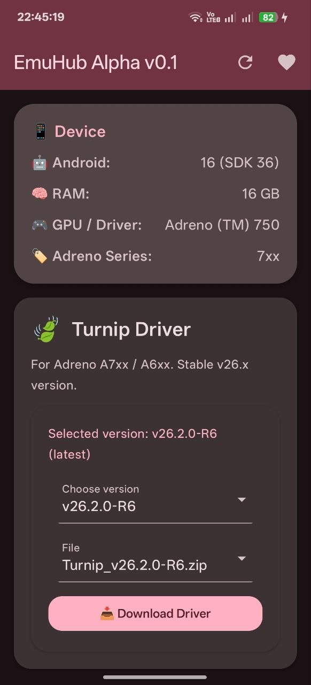
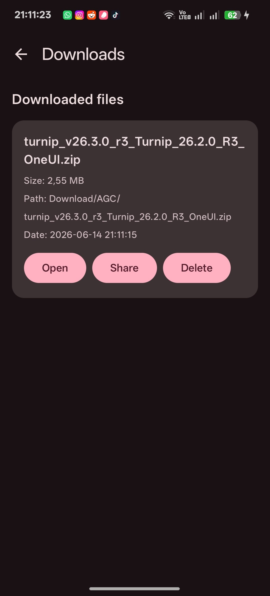

# EmuHub – Turnip & DXVK Driver Manager for Android


EmuHub is an open‑source Android application that helps users download and manage GPU drivers (Turnip and Qualcomm) as well as PC emulation components (Wine, Proton, Box64, DXVK, FEXCore, VKD3D, and more) for Adreno‑powered devices.

The app automatically fetches the latest releases from GitHub, selects the newest available version, and allows users to switch between different driver sources when applicable.

---

## Features

### Device Information

- Displays Android version
- Shows total RAM
- Detects GPU model
- Identifies Adreno GPU series

### Turnip Driver Support

- Automatically recommends the most suitable Turnip driver based on the detected Adreno series.
- **Adreno 8xx** devices can choose between:
  - *StevenMXZ* (official source)
  - *whitebelyash* (experimental source)
- **Adreno 6xx and 7xx** devices use:
  - *StevenMXZ* source only
  - Stable v26.x branch

### Qualcomm Driver Support

- Provides the official Qualcomm driver (v863.1) for Adreno 6xx and 7xx devices.

### Emulation Components

Download and manage:

- Wine
- Proton
- Box64
- WOWBox64
- DXVK
- FEXCore
- VKD3D

All components are sourced from the [WinNative-Emu Components](https://github.com/WinNative-Emu/Components) repository.

### Smart Version Detection

- Versions are sorted using semantic versioning.
- The latest version is automatically selected.
- Examples: `2.10` > `2.9`, `2.7.1` > `2.7.0`

### Download Manager (New! 🚀)

- **Custom download folder** – Choose any folder on your device (via Storage Access Framework). The default is the Downloads folder.
- **Active downloads badge** – The download icon in the top bar shows the number of ongoing downloads.
- **Start toast** – A brief notification confirms that a download has begun.
- **Progress tracking** – Linear progress indicator with percentage and byte counts.
- **Unique filenames** – Duplicate files are automatically renamed with a counter before the extension (e.g., `file (1).zip`).
- **Delete confirmation** – Delete files from the history with a confirmation dialog (file is physically removed).
- **File location display** – Shows the exact folder and filename (e.g., `Download/MyFolder/file.zip`).

### Additional Features

- Manual refresh button to reload data from GitHub.
- One‑tap donation button.
- Modern UI built with Jetpack Compose and Material 3.
- Dynamic colors, animations, and rounded card design.
- Settings screen to manage the download folder.

---

## Screenshots

### Main Screen



### Downloads Screen



---

## Build Instructions

### 1. Clone the Repository

```bash
git clone https://github.com/notzeetaa/EmuHub.git
cd EmuHub
```

### 2. Open in Android Studio

Use Android Studio Ladybug or newer.

### 3. Add Required Dependencies

Ensure your module-level build.gradle.kts contains:

```kotlin
dependencies {
    implementation("com.squareup.okhttp3:okhttp:4.12.0")
    implementation("org.json:json:20240303")
    implementation("androidx.compose.material:material-icons-extended:1.7.8")
    implementation("androidx.documentfile:documentfile:1.0.1")
}
```

### 4. Internet Permission

Already declared in AndroidManifest.xml:

```xml
<uses-permission android:name="android.permission.INTERNET" />
        <!-- For Android 9 and below; Android 10+ uses MediaStore or SAF -->
<uses-permission android:name="android.permission.WRITE_EXTERNAL_STORAGE" android:maxSdkVersion="28" />
```

### 5. Run the Application

Connect an Android device or emulator running Android 5.0 (API 21) or newer and click Run.

---

## How It Works

### Device Information

GPU and RAM information are obtained using:

* ActivityManager
* OpenGL/EGL APIs

### Driver and Component Retrieval

* GitHub Releases are fetched through the public GitHub API (no authentication required).
* The component manifest (Wine, Proton, DXVK, etc.) is downloaded from the WinNative-Emu Components repository.


### Version Comparison

* Versions are compared intelligently using semantic version rules to ensure the newest release is selected automatically.

### Downloads

* Files are saved using the Storage Access Framework (Android 10+) or the classic file system (Android 9 and below).
* If a custom folder is selected, the app stores the folder URI and writes files there.
* Duplicate file names are handled gracefully: file.zip, file (1).zip, file (2).zip, etc.
* Progress is updated in real time.

---

## Credits and Sources

| Component                                 | Source                               |
| ----------------------------------------- | ------------------------------------ |
| Turnip Drivers                            | StevenMXZ/Adreno-Tools-Drivers       |
| Experimental Turnip Drivers               | whitebelyash/AdrenoToolsDrivers      |
| Qualcomm Driver                           | StevenMXZ/Adreno-Tools-Drivers       |
| Wine, Proton, DXVK, Box64, FEXCore, VKD3D | WinNative-Emu/Components             |
| Donations                                 | notzeetaa.github.io/Donate-NotZeetaa |

---

## Requirements

* Android 9.0 (API 28) or newer
* Adreno GPU recommended

The application can still be used on non-Adreno devices, although some drivers and components may not function correctly.

---

## Roadmap

Planned improvements include:

* Automatic update checks
* Additional driver repository support
* Improved error handling and logging (optional)

---

## License

This project is licensed under the MIT License. See the [LICENSE](LICENSE) file for details.

### Third-Party Components

EmuHub does not own any of the drivers, emulation components, or other third-party software available through the application. All rights belong to their respective authors and maintainers.

This application only provides a convenient interface for downloading and managing publicly available releases from their original sources.
---

## Support the Developer

If you find EmuHub useful, consider supporting development:

Donate here

Thank you for supporting the project.

---

EmuHub — Simplifying driver management for Android emulation.
